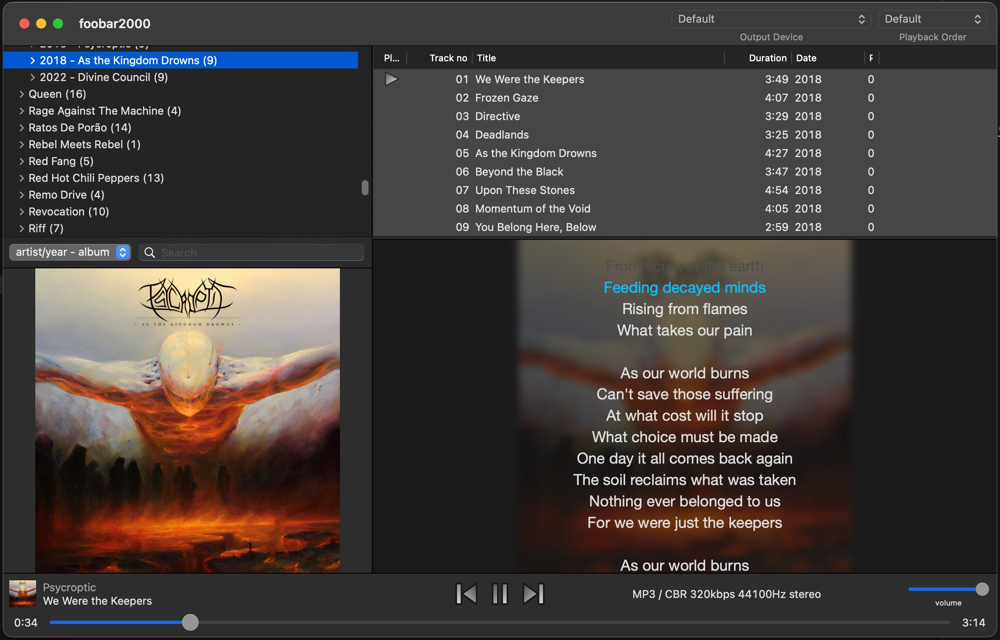

# foo_openlyrics_MacOS

MacOS port of [foo_openlyrics](https://github.com/jacquesh/foo_openlyrics) - an open-source lyrics plugin for foobar2000.

Tries to be a 1:1 port of the Windows version, but some features may be missing or not work as well as they do on Windows. Check the [original repository's README](https://github.com/jacquesh/foo_openlyrics/blob/main/README.md) for more info on the plugin's features and usage.

---

- Requires MacOS 13 (Ventura) or later.
- It should work on foobar2000 2.x and later.

## Installation

- Download `foo_openlyrics_MacOS.fb2k-component` from the [releases page](https://github.com/gabitoesmiapodo/foo_openlyrics_MacOS/releases).
- Install from foobar2000's components section: `foobar2000 -> Settings -> Components -> [+]` and select `foo_openlyrics_MacOS.fb2k-component`.

## Adding the panel to your layout

You can add the component to your layout in `View / Layout / Edit Layout` placing `openlyricsMacOS` in any place you like.

For example, if you use this template:

```
splitter horizontal style=thin
 splitter vertical style=thin
  splitter horizontal style=thin
   albumlist
   albumart type="front cover"
  splitter horizontal style=thin
   playlist
   openlyricsMacOS
 playback-controls
```

You should see something like this:

